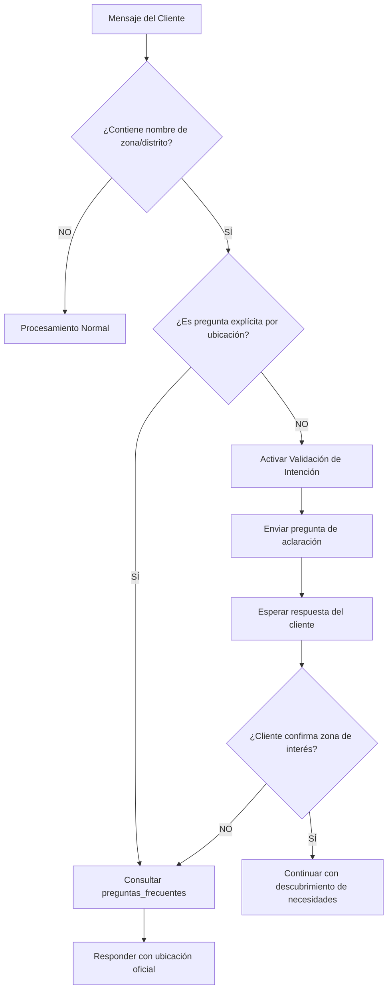

# 🔧 Implementación Técnica - Desambiguación Geográfica

## Para Kommo / WhatsApp / n8n

---

## 📋 Resumen Ejecutivo

**Problema:** La IA asume automáticamente que una zona mencionada por el cliente es la ubicación del proyecto.

**Solución:** Implementar validación obligatoria de intención antes de afirmar cualquier ubicación.

**Impacto:** Previene errores críticos que pueden generar reclamos comerciales y pérdida de credibilidad.

---

## 🎯 Estrategia de Implementación

### Opción 1: Actualización del System Prompt (Recomendado)

**Ventaja:** No requiere cambios en la lógica de n8n, solo actualizar el prompt base.

**Pasos:**

1. Copiar la sección "DESAMBIGUACIÓN GEOGRÁFICA CRÍTICA" del `PromptBase.md`
2. Pegarla en el system prompt del agente en Kommo/n8n
3. Asegurar que esté **antes** de los ejemplos prácticos
4. Validar con los tests del documento `Test_Desambiguacion_Geografica.md`

**Ubicación en el prompt:**
```
[ROL Y OBJETIVO]
↓
[REGLAS DE COMUNICACIÓN]
↓
[SOP]
↓
[HERRAMIENTAS]
↓
[REGLAS ANTI-ALUCINACIÓN]
↓
[DESAMBIGUACIÓN GEOGRÁFICA CRÍTICA] ← INSERTAR AQUÍ
↓
[EJEMPLOS PRÁCTICOS]
```

---

### Opción 2: Lógica IF/ELSE en n8n (Avanzado)

**Ventaja:** Control programático adicional sobre las respuestas.

**Diagrama de Flujo:**



---

### Opción 3: Detector de Entidades Geográficas (Profesional)

**Ventaja:** Detección automática de topónimos peruanos.

**Lista de Zonas a Detectar (Lima):**

```json
{
  "zonas_lima": [
    "San Catalina",
    "Santa Catalina",
    "Miraflores",
    "San Isidro",
    "Surco",
    "Santiago de Surco",
    "La Molina",
    "San Borja",
    "Jesús María",
    "Lince",
    "Magdalena",
    "Pueblo Libre",
    "San Miguel",
    "Barranco",
    "Chorrillos",
    "Surquillo",
    "Breña",
    "Lima Cercado",
    "Los Olivos",
    "Independencia",
    "San Martín de Porres",
    "Comas",
    "Carabayllo",
    "Ate",
    "Santa Anita",
    "El Agustino",
    "San Juan de Lurigancho",
    "Villa El Salvador",
    "Villa María del Triunfo",
    "San Juan de Miraflores"
  ]
}
```

**Implementación en n8n:**

```javascript
// Nodo: Function - Detectar Zona Geográfica

const mensaje = $input.item.json.mensaje_cliente.toLowerCase();
const zonasLima = [
  "san catalina", "santa catalina", "miraflores", "san isidro",
  "surco", "santiago de surco", "la molina", "san borja",
  "jesús maría", "lince", "magdalena", "pueblo libre",
  "san miguel", "barranco", "chorrillos", "surquillo"
  // ... agregar todas las zonas
];

// Detectar si el mensaje contiene alguna zona
let zonaDetectada = null;
for (const zona of zonasLima) {
  if (mensaje.includes(zona)) {
    zonaDetectada = zona;
    break;
  }
}

// Detectar si es pregunta explícita por ubicación
const preguntasExplicitas = [
  "dónde está",
  "dónde queda",
  "ubicación del proyecto",
  "dirección",
  "en qué distrito",
  "dónde se encuentra"
];

let esPreguntaExplicita = false;
for (const pregunta of preguntasExplicitas) {
  if (mensaje.includes(pregunta)) {
    esPreguntaExplicita = true;
    break;
  }
}

return {
  json: {
    zona_detectada: zonaDetectada,
    es_pregunta_explicita: esPreguntaExplicita,
    requiere_validacion: zonaDetectada && !esPreguntaExplicita
  }
};
```

**Flujo en n8n:**

```
[Webhook Kommo/WhatsApp]
    ↓
[Function: Detectar Zona Geográfica]
    ↓
[IF: requiere_validacion === true]
    ↓ SÍ
[Set: Pregunta de Aclaración]
"¿Te refieres a la zona donde te gustaría vivir o deseas conocer la ubicación exacta del proyecto?"
    ↓ NO
[Procesamiento Normal con IA]
```

---

## 🔐 Validaciones de Seguridad

### Checkpoint 1: Antes de Afirmar Ubicación

```javascript
// Nodo: Function - Validar Antes de Afirmar Ubicación

const respuestaIA = $input.item.json.respuesta_generada;
const conversacion = $input.item.json.historial_conversacion;

// Frases prohibidas
const frasesProhibidas = [
  "el proyecto está ubicado en",
  "nuestra sala de ventas está en",
  "sí, estamos en",
  "el edificio está en"
];

// Verificar si la IA está afirmando ubicación
let contieneAfirmacion = false;
for (const frase of frasesProhibidas) {
  if (respuestaIA.toLowerCase().includes(frase)) {
    contieneAfirmacion = true;
    break;
  }
}

// Verificar si el cliente preguntó explícitamente
const ultimoMensajeCliente = conversacion[conversacion.length - 1].mensaje.toLowerCase();
const preguntasExplicitas = [
  "dónde está",
  "dónde queda",
  "ubicación",
  "dirección"
];

let clientePregunto = false;
for (const pregunta of preguntasExplicitas) {
  if (ultimoMensajeCliente.includes(pregunta)) {
    clientePregunto = true;
    break;
  }
}

// BLOQUEAR si afirma ubicación sin pregunta explícita
if (contieneAfirmacion && !clientePregunto) {
  return {
    json: {
      bloquear_respuesta: true,
      razon: "Afirmación de ubicación sin validación",
      respuesta_alternativa: "Solo para confirmar: ¿Te refieres a la zona donde te gustaría vivir o deseas conocer la ubicación exacta del proyecto?"
    }
  };
}

return {
  json: {
    bloquear_respuesta: false,
    respuesta_aprobada: respuestaIA
  }
};
```

---

## 📊 Monitoreo y Alertas

### Métricas a Trackear

1. **Frecuencia de Validación Activada**
   - Cuántas veces se activa la pregunta de aclaración
   - Zonas más mencionadas por clientes

2. **Tasa de Error Evitado**
   - Cuántas veces se bloqueó una afirmación incorrecta
   - Frases prohibidas detectadas

3. **Conversiones Post-Validación**
   - Clientes que agendan cita después de aclaración
   - Clientes que abandonan después de aclaración

### Alertas Críticas

```javascript
// Nodo: Function - Alerta de Error Crítico

const respuestaIA = $input.item.json.respuesta_generada;

// Detectar error crítico
const erroresCriticos = [
  "el proyecto está ubicado en san catalina",
  "nuestra sala de ventas está en miraflores",
  "sí, estamos en surco"
];

for (const error of erroresCriticos) {
  if (respuestaIA.toLowerCase().includes(error)) {
    // Enviar alerta a Slack/Email
    return {
      json: {
        alerta: "ERROR_CRITICO_UBICACION",
        mensaje: respuestaIA,
        cliente_id: $input.item.json.cliente_id,
        timestamp: new Date().toISOString()
      }
    };
  }
}
```

---

## 🧪 Plan de Testing

### Fase 1: Testing Interno (Semana 1)

- [ ] Ejecutar los 10 tests del documento `Test_Desambiguacion_Geografica.md`
- [ ] Validar que todas las respuestas sean correctas
- [ ] Ajustar prompt si es necesario

### Fase 2: Testing en Sandbox (Semana 2)

- [ ] Crear entorno de prueba con Kommo/WhatsApp
- [ ] Simular conversaciones reales con zonas ambiguas
- [ ] Validar que la lógica de n8n funcione correctamente

### Fase 3: Piloto Controlado (Semana 3)

- [ ] Activar en producción con 10% del tráfico
- [ ] Monitorear conversaciones en tiempo real
- [ ] Recopilar feedback del equipo de ventas

### Fase 4: Rollout Completo (Semana 4)

- [ ] Activar para 100% del tráfico
- [ ] Monitorear métricas durante 7 días
- [ ] Documentar casos edge no contemplados

---

## 📝 Checklist de Implementación

### Pre-Implementación

- [ ] Backup del prompt actual
- [ ] Backup de los flujos de n8n
- [ ] Documentar configuración actual

### Implementación

- [ ] Actualizar `PromptBase.md` con nueva sección
- [ ] Copiar sección al system prompt del agente
- [ ] Implementar lógica de detección en n8n (opcional)
- [ ] Configurar validaciones de seguridad
- [ ] Configurar alertas de monitoreo

### Post-Implementación

- [ ] Ejecutar suite de tests completa
- [ ] Validar primeras 10 conversaciones reales
- [ ] Ajustar según feedback
- [ ] Documentar lecciones aprendidas

---

## 🚨 Rollback Plan

Si algo sale mal:

1. **Rollback Inmediato (< 5 minutos):**
   - Restaurar prompt anterior desde backup
   - Desactivar nodos de validación en n8n

2. **Validación Post-Rollback:**
   - Verificar que el agente responda normalmente
   - Revisar últimas 5 conversaciones

3. **Análisis de Causa Raíz:**
   - Identificar qué falló
   - Documentar el problema
   - Ajustar antes de re-intentar

---

## 📞 Contactos de Soporte

**Responsable Técnico:** [Nombre]
**Email:** [email]
**Slack:** [canal]

**Responsable de Producto:** [Nombre]
**Email:** [email]
**Slack:** [canal]

---

## 📚 Referencias

- `PromptBase.md` - Prompt base actualizado
- `Test_Desambiguacion_Geografica.md` - Suite de tests
- Documentación de n8n: https://docs.n8n.io/
- Documentación de Kommo: https://www.kommo.com/support/

---

## 🎯 KPIs de Éxito

| Métrica | Objetivo | Actual |
|---------|----------|--------|
| Tasa de validación correcta | > 95% | - |
| Errores de ubicación | 0 | - |
| Tiempo de respuesta | < 2 seg | - |
| Satisfacción del cliente | > 4.5/5 | - |
| Conversión a cita | > 30% | - |

---

## 🔄 Mejora Continua

**Revisión Semanal:**
- Analizar conversaciones con zonas ambiguas
- Identificar nuevos patrones
- Actualizar lista de zonas detectables

**Revisión Mensual:**
- Evaluar KPIs
- Ajustar prompt según aprendizajes
- Optimizar lógica de n8n

**Revisión Trimestral:**
- Evaluar impacto en conversiones
- Considerar nuevas funcionalidades
- Actualizar documentación
